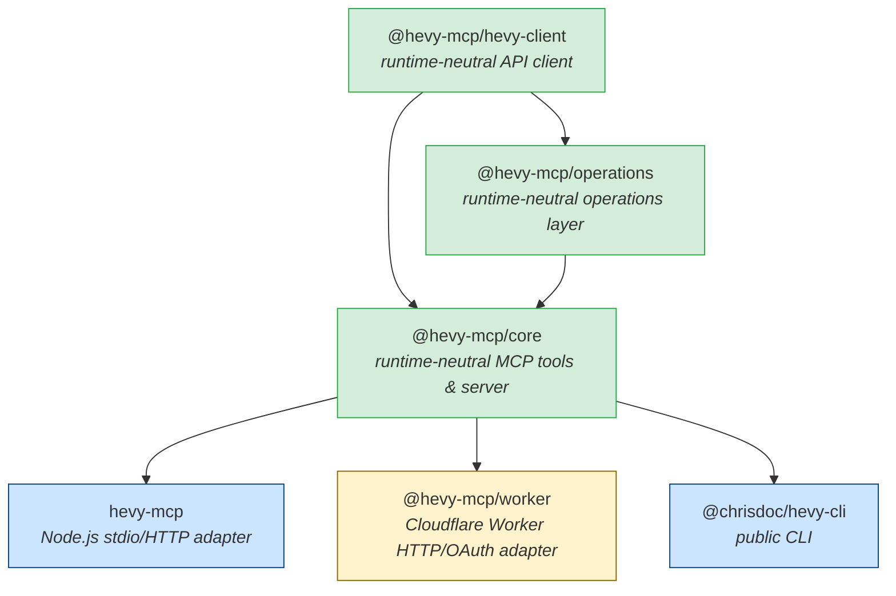
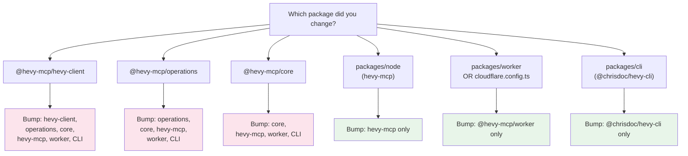

# architecture.md

## Project Architecture Overview

**hevy-mcp** is a [Model Context Protocol (MCP)](https://modelcontextprotocol.io/) server for the [Hevy](https://www.hevyapp.com/) fitness API. It lets AI assistants read, analyze, create, and update workouts, routines, exercise templates, and body measurements through authenticated Hevy API requests [[1]](https://app.dosu.dev/documents/86385d8b-fd28-42af-bebd-e017cd533d92).

The codebase is a TypeScript monorepo organized as a **private workspace orchestrator** with six packages under `packages/`. The root has no runtime `src/` tree — all implementation lives in the workspaces [[2]](https://app.dosu.dev/documents/947ebc0f-60be-4a4e-b227-238f01cd75a6).

The defining architectural property is that a **single MCP tool contract runs identically on two very different runtimes**:

```text
Hosted:  AI assistant  →  Streamable HTTP  →  Cloudflare Worker  →  Hevy API
Local:   AI assistant  →  MCP over stdio   →  local hevy-mcp     →  Hevy API
```

[[3]](https://app.dosu.dev/documents/86385d8b-fd28-42af-bebd-e017cd533d92)

This is achieved by keeping the tool implementations and API client runtime-neutral, then composing them into runtime-specific adapters (Node.js and Cloudflare Workers) that never share code with each other [[4]](https://app.dosu.dev/documents/52dd122f-29f8-46dd-9513-3476b4dbb3ae).

The six workspaces and their roles at a glance:

| Workspace              | Package name            | Role                                                        |
| ---------------------- | ----------------------- | ----------------------------------------------------------- |
| `packages/hevy-client` | `@hevy-mcp/hevy-client` | Runtime-neutral API client (Kubb-generated)                 |
| `packages/operations`  | `@hevy-mcp/operations`  | Runtime-neutral shared operations layer                     |
| `packages/core`        | `@hevy-mcp/core`        | Runtime-neutral MCP tools and server construction           |
| `packages/node`        | `hevy-mcp`              | Node.js stdio/HTTP adapter — the only publishable workspace |
| `packages/worker`      | `@hevy-mcp/worker`      | Private Cloudflare Worker HTTP/OAuth adapter                |
| `packages/cli`         | `@chrisdoc/hevy-cli`    | Public Hevy command-line client                             |

[[5]](https://app.dosu.dev/documents/947ebc0f-60be-4a4e-b227-238f01cd75a6)

## Workspace Dependency Diagram

The shipped composition graph flows from the runtime-neutral packages outward to the platform adapters and public CLI [[6]](https://app.dosu.dev/documents/52dd122f-29f8-46dd-9513-3476b4dbb3ae):



**Legend:** Green = runtime-neutral · Blue = Node.js adapter · Amber = Cloudflare adapter

Key constraints to observe in this diagram [[7]](https://app.dosu.dev/documents/947ebc0f-60be-4a4e-b227-238f01cd75a6):

- `hevy-client`, `operations`, and `core` are **runtime-neutral**: they contain no Node.js built-ins and no Cloudflare-specific bindings, making them safe to import and execute in either runtime.
- `hevy-mcp` (Node) and `@hevy-mcp/worker` (Cloudflare) both consume `core` but **must never import each other**. This boundary is enforced by the `package-boundaries` validation lane [[8]](https://github.com/chrisdoc/hevy-mcp/blob/c4ac07dbe84a7e83ba88a5073f0a83ab34af5c86/repository/validation-lanes.json#L209-L227).
- `@chrisdoc/hevy-cli` bundles the runtime-neutral packages directly and does **not** depend on either adapter.
- `@hevy-mcp/core` depends on both `@hevy-mcp/hevy-client` and `@hevy-mcp/operations` [[9]](https://github.com/chrisdoc/hevy-mcp/blob/47eac6bd864bbfc1d66bbd48881df895e1a4214e/packages/core/package.json#L20-L24); `@hevy-mcp/operations` depends on `@hevy-mcp/hevy-client` [[10]](https://github.com/chrisdoc/hevy-mcp/blob/47eac6bd864bbfc1d66bbd48881df895e1a4214e/packages/operations/package.json#L16-L18).

> [!IMPORTANT]
> The adapter packages (`hevy-mcp` and `@hevy-mcp/worker`) must never import one another. Violating this constraint would pull Node-specific or Cloudflare-specific code into the wrong runtime bundle and cause hard failures at runtime.

## Runtime-Neutral vs. Platform Adapters

### What "runtime-neutral" means

A package is **runtime-neutral** when it makes no assumptions about the JavaScript host environment. Concretely, this means:

- **No Node.js built-ins**: `process`, `fs`, `child_process`, `path`, `crypto` (Node's version), etc. are forbidden.
- **No Cloudflare-specific bindings**: KV namespaces, Durable Objects, environment secrets injected via `env` object, and Worker-specific globals are forbidden.
- **Standard Web APIs only**: `fetch`, `URL`, `TextEncoder`, `crypto` (Web Crypto), and the rest of the [WinterCG](https://wintercg.org/) baseline.

The two packages that must satisfy this constraint are `packages/hevy-client` and `packages/core` [[11]](https://app.dosu.dev/documents/52dd122f-29f8-46dd-9513-3476b4dbb3ae). The `packages/operations` layer also sits in this neutral zone — it depends only on `hevy-client` and adds no platform imports [[10]](https://github.com/chrisdoc/hevy-mcp/blob/47eac6bd864bbfc1d66bbd48881df895e1a4214e/packages/operations/package.json#L16-L18).

### The adapter pattern

Platform-specific concerns are isolated to the adapter packages:

| Package           | Owns                                                                                                                                                        |
| ----------------- | ----------------------------------------------------------------------------------------------------------------------------------------------------------- |
| `packages/node`   | stdio transport, local Streamable HTTP transport, process lifecycle (`SIGTERM`/`SIGINT`), Node telemetry (Sentry, OTLP), stdio observability, update checks |
| `packages/worker` | Cloudflare Worker HTTP entrypoint, Streamable HTTP handler, OAuth 2.1 layer (KV-backed), Cloudflare bindings and environment types                          |

[[12]](https://app.dosu.dev/documents/52dd122f-29f8-46dd-9513-3476b4dbb3ae)

### Enforcement

The `package-boundaries` lane (blocking, runs on Node 24 and 26) uses dependency-cruiser to statically validate that the boundary rules hold across the entire workspace graph [[8]](https://github.com/chrisdoc/hevy-mcp/blob/c4ac07dbe84a7e83ba88a5073f0a83ab34af5c86/repository/validation-lanes.json#L209-L227). A pull request that introduces a Node built-in into `packages/core` or a Cloudflare binding into `packages/hevy-client` will fail CI before merge.

> [!NOTE]
> `packages/node/src/utils/stdio-observability.ts` is a deliberate exception: it resides in the Node adapter and instruments private MCP SDK internals. The runtime-neutral packages themselves remain clean; see [Key Design Decisions](#key-design-decisions) for details on the stdio observability tradeoff.

## Why This Structure Exists

### One tool contract, two runtimes

The primary motivation is to expose the same 26 MCP tools to users regardless of whether they run the server locally via npm or connect to the hosted Cloudflare endpoint. Splitting implementation into runtime-neutral packages and thin adapters is the only way to achieve this without duplicating logic [[13]](https://app.dosu.dev/documents/86385d8b-fd28-42af-bebd-e017cd533d92).

### Preventing invalid bundles

Bundling Node.js code (anything that imports `process`, `fs`, `os`, etc.) into a Cloudflare Worker will fail at deploy time or produce silent runtime errors. Conversely, shipping Cloudflare bindings inside the published npm package would make it non-functional on a developer's machine. The strict layer boundary eliminates both failure modes at the source [[12]](https://app.dosu.dev/documents/52dd122f-29f8-46dd-9513-3476b4dbb3ae).

### Clean published surface

Only one workspace is publishable to npm: `hevy-mcp` (the Node adapter). Everything else is either a private internal package or a separate public package:

| Package                 | Published? | Why                                     |
| ----------------------- | ---------- | --------------------------------------- |
| `hevy-mcp`              | ✅ npm     | The user-facing Node.js MCP server      |
| `@chrisdoc/hevy-cli`    | ✅ npm     | Public standalone CLI                   |
| `@hevy-mcp/core`        | ❌ private | Internal; bundled into both adapters    |
| `@hevy-mcp/hevy-client` | ❌ private | Internal; bundled into both adapters    |
| `@hevy-mcp/operations`  | ❌ private | Internal; bundled into both adapters    |
| `@hevy-mcp/worker`      | ❌ private | Deployed directly to Cloudflare Workers |

[[14]](https://app.dosu.dev/documents/52dd122f-29f8-46dd-9513-3476b4dbb3ae)

### Private versioning for release/deployment identity

The private workspaces (`core`, `hevy-client`, `operations`, `worker`) are still versioned using Changesets. This provides internal release and deployment identity — for example, knowing exactly which `@hevy-mcp/core` version is running in production — without ever creating npm tags (`privatePackages.tag=false`) [[14]](https://app.dosu.dev/documents/52dd122f-29f8-46dd-9513-3476b4dbb3ae).

> [!NOTE]
> Worker deployment happens only when a Changesets version commit changes `packages/worker/package.json`. Public Node or CLI releases do not trigger a Worker deploy; Worker-only private releases still do [[15]](https://app.dosu.dev/documents/52dd122f-29f8-46dd-9513-3476b4dbb3ae).

## Changeset Cascade

Because the private packages are bundled into the published adapters, a change in a shared package must version-bump every downstream consumer. This "cascade" is enforced by the `package-changesets` CI lane (`npm run check:changeset`), which uses the `release-cascade` comparison from `repository/validation-lanes.json` as its machine-readable source of truth [[16]](https://github.com/chrisdoc/hevy-mcp/blob/c4ac07dbe84a7e83ba88a5073f0a83ab34af5c86/repository/validation-lanes.json#L259-L273).

### Cascade rules



The full matrix [[17]](https://app.dosu.dev/documents/52dd122f-29f8-46dd-9513-3476b4dbb3ae) [[18]](https://app.dosu.dev/documents/947ebc0f-60be-4a4e-b227-238f01cd75a6):

| Changed package                         | Required changeset packages                                                                                             |
| --------------------------------------- | ----------------------------------------------------------------------------------------------------------------------- |
| `@hevy-mcp/hevy-client`                 | `@hevy-mcp/hevy-client`, `@hevy-mcp/operations`, `@hevy-mcp/core`, `hevy-mcp`, `@hevy-mcp/worker`, `@chrisdoc/hevy-cli` |
| `@hevy-mcp/operations`                  | `@hevy-mcp/operations`, `@hevy-mcp/core`, `hevy-mcp`, `@hevy-mcp/worker`, `@chrisdoc/hevy-cli`                          |
| `@hevy-mcp/core`                        | `@hevy-mcp/core`, `hevy-mcp`, `@hevy-mcp/worker`, `@chrisdoc/hevy-cli`                                                  |
| Node adapter only                       | `hevy-mcp` only                                                                                                         |
| Worker only (or `cloudflare.config.ts`) | `@hevy-mcp/worker` only                                                                                                 |
| CLI only                                | `@chrisdoc/hevy-cli` only                                                                                               |

### Concrete examples

| Change                                  | Packages touched               | Required changeset packages                                            |
| --------------------------------------- | ------------------------------ | ---------------------------------------------------------------------- |
| Adding a new MCP tool                   | `packages/core`                | `@hevy-mcp/core`, `hevy-mcp`, `@hevy-mcp/worker`, `@chrisdoc/hevy-cli` |
| Fixing a bug in the Hevy client wrapper | `packages/hevy-client`         | All six packages                                                       |
| Updating Worker OAuth logic             | `packages/worker`              | `@hevy-mcp/worker` only                                                |
| Adding a CLI subcommand                 | `packages/cli`                 | `@chrisdoc/hevy-cli` only                                              |
| Updating `cloudflare.config.ts`         | (root, Worker release trigger) | `@hevy-mcp/worker` only                                                |

### How it is enforced

CI runs `npm run check:changeset` (`npx changeset status --since=origin/<base_branch>`) as a blocking gate on every pull request [[19]](https://app.dosu.dev/documents/947ebc0f-60be-4a4e-b227-238f01cd75a6). The `package-changesets` lane checks that every changed workspace directory has a changeset file that names that package, then applies the transitive composition matrix. The `release-cascade` comparison label in `repository/validation-lanes.json` is the machine-readable definition driving this check [[20]](https://github.com/chrisdoc/hevy-mcp/blob/c4ac07dbe84a7e83ba88a5073f0a83ab34af5c86/repository/validation-lanes.json#L259-L287).

> [!IMPORTANT]
> The Conventional Commit type (`chore:`, `docs:`, etc.) does **not** determine changeset eligibility. What matters is whether the change touches a file under `packages/*`, modifies runtime-visible behaviour, changes a workspace dependency, or updates an explicit release trigger like `cloudflare.config.ts` [[21]](https://app.dosu.dev/documents/947ebc0f-60be-4a4e-b227-238f01cd75a6).

## Key Design Decisions

### Generated API client via Kubb

The Hevy API client, TypeScript types, and Zod schemas under `packages/hevy-client/src/generated/` are produced by [Kubb](https://kubb.dev/) from the Hevy OpenAPI specification [[22]](https://app.dosu.dev/documents/52dd122f-29f8-46dd-9513-3476b4dbb3ae). The generation pipeline is:

```bash
npm run openapi       # fetch upstream Hevy spec → openapi-spec.json
npm run build:client  # run Kubb → packages/hevy-client/src/generated/
```

> [!WARNING]
> **Never edit files in `packages/hevy-client/src/generated/` by hand.** All generated TypeScript errors in that directory are expected and should be ignored. Fixes belong in `scripts/openapi-spec.js` (applied before spec write) so they survive future regenerations [[23]](https://app.dosu.dev/documents/947ebc0f-60be-4a4e-b227-238f01cd75a6).

Only the curated package barrels (`@hevy-mcp/hevy-client/types` and `@hevy-mcp/hevy-client/schemas`) are the public API of the client package. Generated API functions and `.kubb` internals are private [[24]](https://app.dosu.dev/documents/947ebc0f-60be-4a4e-b227-238f01cd75a6).

### Zod schema inference for type-safe tool parameters

All MCP tool handlers use **Zod schema inference** via the `InferToolParams` utility from `packages/core/src/utils/tool-helpers.ts`. This eliminates manual type assertions and ensures parameter types always match their validation schemas [[25]](https://app.dosu.dev/documents/947ebc0f-60be-4a4e-b227-238f01cd75a6).

```typescript
import type { InferToolParams } from "../utils/tool-helpers.js";

const getRoutinesSchema = {
	page: z.coerce.number().int().gte(1).default(1),
	pageSize: z.coerce.number().int().gte(1).lte(10).default(5),
} as const;

type GetRoutinesParams = InferToolParams<typeof getRoutinesSchema>;
// ↑ Types are automatically derived — no manual interface needed
```

See [TYPE_SAFETY_GUIDE.md](./TYPE_SAFETY_GUIDE.md) for the complete pattern, including `createTypedToolHandler` and response-formatter co-location rules.

> [!NOTE]
> Never use `args as { ... }` type assertions, `Record<string, unknown>` in handler signatures, or define parameter types separately from their Zod schemas. These patterns break the single-source-of-truth contract and defeat compile-time safety [[26]](https://app.dosu.dev/documents/947ebc0f-60be-4a4e-b227-238f01cd75a6).

### Centralized error handling via `withErrorHandling`

Every MCP tool handler is wrapped with `withErrorHandling` from `packages/core/src/utils/error-handler.ts`. This utility:

- Catches all handler errors and converts them to standardized `isError: true` MCP responses.
- Preserves the full TypeScript parameter types of the wrapped function.
- Attaches a `context` string used in error diagnostics.

```typescript
server.registerTool(
	"get-routines",
	{ description: "...", inputSchema: z.object(getRoutinesSchema) },
	withErrorHandling(async (args: GetRoutinesParams) => {
		// handler body
	}, "get-routines"),
);
```

[[27]](https://app.dosu.dev/documents/947ebc0f-60be-4a4e-b227-238f01cd75a6)

### MCP SDK internals dependency for stdio observability

`packages/node/src/utils/stdio-observability.ts` instruments **private MCP SDK stdio fields** to provide raw chunk observability that is not exposed through the SDK's public API [[28]](https://app.dosu.dev/documents/52dd122f-29f8-46dd-9513-3476b4dbb3ae):

- `_ondata` — wrapped to capture incoming chunk byte length and BOM detection before forwarding.
- `_readBuffer` — accessed to replace `readMessage` with an instrumented parser hook.
- `_buffer` — read and rewritten during newline-delimited message extraction.

[[29]](https://github.com/chrisdoc/hevy-mcp/blob/c4ac07dbe84a7e83ba88a5073f0a83ab34af5c86/packages/node/src/utils/stdio-observability.ts#L41-L67)

The adapter is **fail-closed**: if the private fields are absent (e.g., after an SDK refactor), instrumentation is silently skipped and the original transport is returned unchanged [[30]](https://github.com/chrisdoc/hevy-mcp/blob/c4ac07dbe84a7e83ba88a5073f0a83ab34af5c86/packages/node/src/utils/stdio-observability.ts#L86-L90).

> [!WARNING]
> This is a deliberate architectural tradeoff: private SDK field access provides critical stdio observability that cannot be obtained otherwise, but it means SDK upgrades need careful testing. **Always re-run the complete stdio observability test suite (`npm run test:stdio`) after every MCP TypeScript SDK package upgrade** and inspect the SDK compatibility assumptions before merging [[31]](https://app.dosu.dev/documents/52dd122f-29f8-46dd-9513-3476b4dbb3ae).

## Related Documentation

| Document                                       | What it covers                                                                                                 |
| ---------------------------------------------- | -------------------------------------------------------------------------------------------------------------- |
| [CONTRIBUTING.md](../CONTRIBUTING.md)          | Development workflow, environment setup, testing lanes, PR requirements, and changeset rules                   |
| [TYPE_SAFETY_GUIDE.md](./TYPE_SAFETY_GUIDE.md) | Type safety patterns, `InferToolParams` usage, API client barrel imports, and response-formatter co-location   |
| [test-lanes.md](./test-lanes.md)               | Testing strategy, lane ownership, and which lane covers which package or concern                               |
| `deployment-modes.md`                          | _(forthcoming)_ Detailed coverage of Node stdio, Node HTTP, Cloudflare Worker HTTP, and OAuth deployment modes |

For the machine-readable source of truth on CI validation, see [`repository/validation-lanes.json`](../repository/validation-lanes.json) [[32]](https://github.com/chrisdoc/hevy-mcp/blob/c4ac07dbe84a7e83ba88a5073f0a83ab34af5c86/repository/validation-lanes.json#L1-L15), which defines all blocking and informational lanes, runtime matrices, and aggregate workflows used by CI and pre-push hooks.
